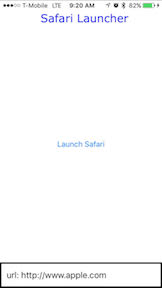

## SafariLauncher 安装说明

在 iOS 9.3 及以下的真机上使用 Instruments 运行移动端网页测试，需要引入一个第三方 app [SafariLauncher](https://github.com/snevesbarros/SafariLauncher)。
这是因为用 Instruments 不能在设备上启动 Safari。而 `SafariLauncher` 启动后会启动 Safari。简单吧！

在一些配置下，Appium 可以在需要时自动构建、签名并且安装 `SafariLauncher`，不需要额外做什么。如果不行，很可能是因为新版本的 [Xcode](https://developer.apple.com/xcode/)，需要完成以下配置才能成功在真机上运行 Safari 测试。

### 自动配置 SafariLauncher

只要新建一个用于发布 `SafariLauncher` 应用的 **provisioning profile** 就可以自动配置 `SafariLauncher`。特殊之处是需要一个通配符证书，而免费的苹果开发者账号不能创建通配符证书。所以免费账号需要用下面的手动配置方法。

创建 launcher 使用的 profile 需要进入 **Apple Developers Member Center** 然后：
  * **步骤 1:** 创建 **新的 App Id**，选择通配符 App ID 选项并填写为"*"。
  * **步骤 2:** 创建 **新的 Development Profile** 关联步骤 1 创建的 App Id。
  * **步骤 3:** 选择你的 **certificate(s) and device(s)** 然后点击下一步。
  * **步骤 4:** 填写 profile 名称然后 **generate the profile**。
  * **步骤 5:** 下载 profile 用编辑器打开。
  * **步骤 6:** 搜索 **UUID**，字符串是你的 **identity code**。

现在只需在 desired capabilities 中填入你的 UDID 和 device name：
```js
{
  udid: '...',
  deviceName: '...',
  platformName: 'iOS',
  platformVersion: '9.3',
  browserName: 'Safari'
}
```


### 手动配置 SafariLauncher

**注意:** 这个过程假定你是 [Xcode](https://developer.apple.com/xcode/) 7.3 或 7.3.1。

可以使用 [appium-ios-driver](https://github.com/appium/appium-ios-driver) 包含的 [SafariLauncher](https://github.com/snevesbarros/SafariLauncher) 版本，但是每次升级 Appium 后都必须重新做一遍。

先从 [GitHub](https://github.com/) 克隆 `SafariLauncher` 得到本地拷贝：
```bash
git clone https://github.com/snevesbarros/SafariLauncher.git
```

在本地有了 `SafariLauncher` 应用的源码后用 [Xcode](https://developer.apple.com/xcode/) 打开 `SafariLauncher` 项目


在 `SafariLauncher` target 面板会看到应用需要 provisioning profile 的错误提示。


修复错误需要先输入应用的 "Bundle Identifier"，默认情况 Appium 使用 `com.bytearc.SafariLauncher`。如果用这个不能构建就换一个并记下来。然后选择 "Team"，接着允许创建 provisioning profile。


最后选择连上电脑的设备作为目标


执行 "Run"，构建后安装 app 到你的设备上


现在 `SafariLauncher` 可以在你的设备上工作了。app 只有一个简单的页面，点击按钮会启动 `Safari`



最后一步只有在你没有使用默认 bundle identifier(`com.bytearc.SafariLauncher`) 的情况下才需要。Appium 在创建会话时需要通过 `bundleId` desired capability 知道你使用的 bundle identifier：
```js
{
  udid: '...',
  deviceName: '...',
  platformName: 'iOS',
  platformVersion: '9.3',
  browserName: 'Safari',
  bundleId: 'com.imurchie.SafariLauncher'
}
```
